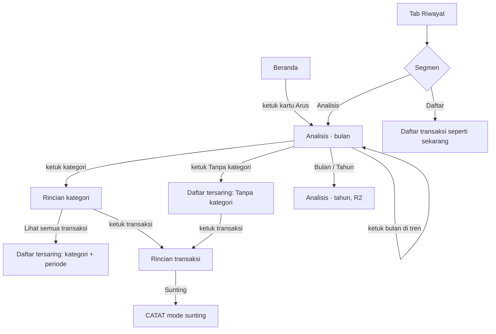

# Analisis keuangan: ke mana uang pergi dan bagaimana trennya

**Tanggal:** 10 Oktober 2026.
**Status:** Diputuskan pemilik 10 Okt 2026 (§15). Kebutuhan FR-ANL di PRD
§7.9; tugas R1 di Fase 19 TASK_LIST, R2 di antrean B-38. Periode mengikuti
[FINANCIAL_PERIOD.md](FINANCIAL_PERIOD.md) dan
[ADR-038](../../02-architecture/adr/0038-periode-keuangan-berriwayat-dan-peralihan.md).
**Berkaitan:** [PRD 2.0](../prd-saldough-2.0.md) §3 (tujuan "rasa
kemajuan"), §6 (analitik lanjutan di luar MVP), §12 ("Laporan bulanan dan
tahunan beserta grafiknya"); [RECURRING_AND_FORECAST.md](RECURRING_AND_FORECAST.md)
§7B (katalog wawasan dan aturan nadanya); [ADR-026](../../02-architecture/adr/0026-sistem-kategori.md)
(kategori); [ADR-035](../../02-architecture/adr/0035-transaksi-rutin-rencana-dan-perkiraan.md)
§3.6 (bulan keuangan); [ADR-019](../../02-architecture/adr/0019-tarif-di-entri-dan-transaksi-milik-pembayaran.md)
(transaksi milik pembayaran freelance).

Dokumen ini merancang **perilaku, alur, dan aturan**. Rupa visual (bentuk
grafik, warna, tata letak) diserahkan ke pemilik lewat design system dan
prototipe; daftarnya di §14.

## 1. Ringkasan keputusan

1. **Beranda tidak dirombak; Analisis adalah tempat membaca ke belakang.**
   Beranda menjawab "keadaanku sekarang" dan dibuka harian untuk bertindak,
   Rencana menjawab "ke depan", Analisis menjawab "apa yang sudah terjadi,
   dikelompokkan dan dibandingkan". Beranda baru ditata ulang bila data
   pemakaian (`analysis_viewed{source: home}`) menunjukkan perlunya.
   Alasannya: irama baca berbeda, risiko nada menghakimi pada layar harian
   (O7), Beranda harus berguna sejak hari pertama, dan NFR-PERF-002.
2. **Tempat: segmen Analisis di tab Riwayat** (`Daftar | Analisis`), plus
   satu pintu dari kartu Arus di Beranda. Tidak ada tab kelima (KT-A2).
3. **Inti R1 adalah pengeluaran per kategori bulan ini**, dibandingkan dengan
   rata-rata bulan sebelumnya, dan tren pemasukan, pengeluaran, serta selisih
   enam bulan.
4. **Setiap angka bisa dibongkar sampai ke transaksinya.** Kategori → rincian
   kategori → daftar transaksi di Riwayat → rincian transaksi.
5. **Analisis tidak pernah menulis data keuangan.** Ia hanya membaca transaksi
   tercatat. Satu-satunya jalan mengubah angka adalah membetulkan transaksi
   lewat alur yang sudah ada (sunting di CATAT).
6. **Nada netral.** "Lebih tinggi dari biasanya", bukan "boros". Tanpa skor,
   tanpa peringatan merah untuk belanja yang naik (RECURRING_AND_FORECAST
   §7B aturan 3).
7. **Transfer tidak pernah masuk total**, termasuk transfer yang ditautkan ke
   pos tabungan. Ia tampil sebagai baris informasi terpisah.
8. **Rencana memotong bulan per baris rencana, Analisis per kategori**, dan
   totalnya cocok (aturan B-15). Rencana tidak pernah menampilkan kategori;
   Analisis tidak pernah menampilkan perkiraan, pos anggaran, atau uang
   nganggur. Jembatan satu arah dari Rencana: kilas balik bulan lalu (R1) dan
   baris "Di luar rencana" (R2).

## 2. Masalah dan bukti

- PRD §12 sudah menjadwalkan "laporan bulanan dan tahunan beserta grafiknya"
  sebagai pengembangan sesudah MVP, dan §3 menetapkan tujuan "memberi rasa
  kemajuan, bukan sekadar daftar angka". Sekarang tidak ada layar yang
  memenuhi keduanya.
- Beranda hanya punya **dua angka** untuk bulan berjalan (pemasukan dan
  pengeluaran, FR-HOME-001). Untuk tahu ke mana pengeluaran Rp11.420.700
  pergi, pengguna harus menyaring Riwayat per kategori satu per satu dan
  menjumlah sendiri, persis kerja manual yang ingin dihapus aplikasi ini.
- Rencana › Bulan ini menjawab rencana vs nyata **per rencana** (rutin dan
  anggaran), bukan per kategori, dan hanya untuk bulan yang direncanakan.
  Pengeluaran di luar anggaran tidak punya tempat dibaca.
- Kategori sudah ada sejak ADR-026 (bawaan + buatan pengguna) dan suara
  serta notifikasi mengisinya otomatis. Data kategorinya ada; yang belum ada
  cara membacanya.
- Permintaan langsung pemilik (10 Okt 2026).

**Asumsi yang belum terbukti:** pengguna ingin membandingkan dengan bulan
lalu, bukan hanya melihat bulan ini. Belum ada data pemakaian; ukurannya di
§4.

## 3. Pekerjaan pengguna

| # | Pekerjaan | Sekarang | R |
|---|---|---|---|
| A1 | "Ke mana uangku pergi bulan ini?" | Saring Riwayat per kategori, jumlah sendiri | R1 |
| A2 | "Bulan ini lebih tinggi atau lebih rendah dari biasanya, di bagian mana?" | Tidak ada | R1 |
| A3 | "Uangku datang dari mana?" (gaji, freelance, lainnya) | Tidak ada | R1 |
| A4 | "Beberapa bulan terakhir aku nambah atau berkurang?" (selisih per bulan) | Tidak ada | R1 |
| A5 | "Satu kategori ini, berapa tiap bulannya, dan transaksinya apa saja?" | Saring Riwayat, tanpa total | R1 |
| A6 | "Setahun ini totalnya berapa?" | Tidak ada | R2 |
| A7 | "Total uangku naik dari bulan ke bulan?" (tren total saldo) | Tidak ada | R2, KT-A5 |
| A8 | "Berapa bagian pengeluaranku yang sudah pasti tiap bulan (rutin)?" | Sebagian di W8 Rencana | R2 |

## 4. Tujuan, non-tujuan, dan ukuran keberhasilan

**Tujuan.** A1–A5 terjawab dalam paling banyak dua ketukan dari Beranda atau
tab Riwayat, dengan angka yang cocok persis dengan Riwayat dan Beranda.

**Non-tujuan.** Lihat §16.

**Ukuran keberhasilan** (lewat `AppAnalytics`, tanpa nominal dan tanpa nama
kategori buatan pengguna):

| Ukuran | Definisi | Sinyal baik |
|---|---|---|
| Kunjungan bulanan | Pengguna aktif yang membuka Analisis ≥1× per bulan | Naik dan bertahan sesudah bulan pertama |
| Bongkar ke transaksi | Kunjungan yang membuka rincian kategori | Analisis dipakai untuk memahami, bukan sekadar dilihat |
| Porsi tanpa kategori | Nominal pengeluaran "Tanpa kategori" ÷ total pengeluaran, per bulan | Turun dari bulan ke bulan (pintu "Beri kategori" bekerja) |
| Frekuensi pencatatan | Ukuran PRD §3 yang sudah ada | **Tidak turun.** Bila turun, analisis terasa menghakimi |

Peristiwa usulan: `analysis_viewed{view: month|year, kind: expense|income,
source: history|home}`, `analysis_category_opened{category: <builtInKey>|custom|none|freelance}`,
`analysis_uncategorized_fix_opened`.

## 5. Posisi terhadap Beranda dan Rencana

| Pertanyaan | Tempatnya | Catatan |
|---|---|---|
| Berapa uangku sekarang, di mana | Beranda, Dompet | Tidak berubah |
| Berapa masuk dan keluar bulan ini (dua angka) | Beranda › Arus | Tidak berubah; jadi pintu ke Analisis |
| Ke mana pengeluaranku pergi, per kategori | **Analisis** | Baru |
| Dibanding biasanya bagaimana | **Analisis** | Baru |
| Tren beberapa bulan | **Analisis** | Baru |
| Rencana vs nyata, uang nganggur, perkiraan | Rencana › Bulan ini | Tidak berubah; Analisis tidak membuat perkiraan |
| Rencana vs nyata bulan lalu (W10/W9) | Rencana › tinjau awal bulan | Lembar kilas balik mendapat "Lihat rincian {bulan}" ke Analisis bulan itu (R1) |
| Pengeluaran di luar rencana, per kategori | Analisis, tersaring | Baris "Di luar rencana" di Bulan ini membuka Analisis tersaring (R2) |
| Progres anggaran | Rencana › Anggaran | Tidak berubah; Analisis tidak menampilkan pos |

## 6. Arsitektur informasi

- **Segmen, bukan tab baru.** Riwayat sudah menjadi tempat "apa yang sudah
  terjadi" dan sudah punya penyaring dompet/kategori serta pemilih bulan.
  Tab kelima melanggar batas lebar 360dp (T-8.8) dan menambah keputusan di
  navigasi utama.
- Segmen yang terakhir dipilih diingat per perangkat (preferensi tampilan,
  bukan data keuangan). Bawaan: Daftar.
- Pintu dari Beranda selalu membuka **bulan berjalan, pengeluaran, semua
  dompet**.

## 7. Alur pengguna

### F1. Ke mana uangku pergi bulan ini (A1) — 2 ketuk dari Beranda

1. Beranda → ketuk kartu Arus.
2. Analisis bulan berjalan terbuka di **Pengeluaran**: total, lalu daftar
   kategori urut nominal terbesar.
3. Ketuk satu kategori → Rincian kategori (F4).

Keluar: kembali ke Beranda.

### F2. Dibanding biasanya (A2)

1. Di Analisis bulan, tiap kategori membawa pembanding "rata-rata N bulan"
   bila ada bulan pembanding (aturan B-6).
2. Paling banyak tiga kategori dengan perubahan terbesar disorot di atas
   daftar (aturan B-7), dengan kalimat netral.
3. Ketuk sorotan → Rincian kategori itu.

### F3. Uangku dari mana (A3)

1. Di Analisis bulan, pindah dari Pengeluaran ke **Pemasukan**.
2. Daftar kategori pemasukan, termasuk kelompok **Freelance** (aturan B-9).
3. Pilihan jenis diingat selama sesi; pintu dari Beranda selalu kembali ke
   Pengeluaran.

### F4. Satu kategori (A5)

1. Rincian kategori: total periode, pembanding, tren enam bulan kategori ini,
   lalu transaksi periode itu (terbaru dulu, paling banyak 20).
2. "Lihat semua transaksi" → segmen Daftar di Riwayat tersaring kategori dan
   periode yang sama. Jumlah yang tampil di sana harus sama dengan total di
   rincian kategori.
3. Ketuk transaksi → Rincian transaksi seperti sekarang. Sunting lewat CATAT;
   sekembalinya, angka Analisis sudah segar.

### F5. Membetulkan "Tanpa kategori"

1. Baris "Tanpa kategori" selalu tampil terpisah di akhir daftar bila
   nominalnya > 0, dengan aksi **Beri kategori**.
2. Ketuk → Daftar tersaring "Tanpa kategori" untuk periode itu.
3. Ketuk transaksi → Rincian → Sunting → CATAT, pilih kategori, simpan.
4. Kembali → daftar tersaring berkurang satu; kembali lagi → Analisis segar.

Pemasukan dari pembayaran freelance tidak pernah masuk "Tanpa kategori"
(aturan B-9), karena transaksinya tidak bisa disunting langsung (ADR-019).

### F6. Pindah bulan dan tren (A4)

1. Pemilih bulan ‹ › di kepala Analisis. Tidak bisa maju melewati bulan
   berjalan (Analisis tidak membuat perkiraan; masa depan ada di Rencana).
2. Tren enam bulan (berakhir di bulan terpilih) menunjukkan pemasukan,
   pengeluaran, dan selisih per bulan. Ketuk satu bulan di tren → Analisis
   pindah ke bulan itu.
3. Bulan sebelum bulan pertama pencatatan tidak ditampilkan di tren (bukan
   ditampilkan sebagai nol).

### F7. Per dompet

1. Penyaring dompet "Semua dompet ▾" seperti di Rencana › Bulan ini.
2. Dengan satu dompet terpilih, total dan kategori hanya dari transaksi dompet
   itu; transfer masuk dan keluar dompet itu tampil sebagai baris informasi
   (aturan B-4).

### F8. Dari Rencana

1. **Kilas balik (R1).** Kartu tinjau awal bulan → lembar kilas balik →
   **Lihat rincian September** → Analisis September, Pengeluaran, semua
   dompet.
2. **Di luar rencana (R2).** Bulan ini → ketuk baris Di luar rencana →
   Analisis periode itu dengan penyaring "Di luar rencana": hanya
   pengeluaran yang tidak tertaut pos dan tidak berasal dari rutin (definisi
   `unplannedOut` di `monthPlan`), per kategori. Totalnya sama dengan angka
   baris itu.

### Cabang dan jalan pulang

| Keadaan | Perilaku |
|---|---|
| Belum ada transaksi sama sekali | Keadaan kosong: "Belum ada yang bisa dianalisis" + **Catat transaksi** (membuka CATAT) |
| Bulan terpilih tanpa pengeluaran | "Belum ada pengeluaran di Oktober." Tren dan pindah ke Pemasukan tetap tersedia |
| Baru satu bulan pencatatan | Daftar kategori tampil, pembanding dan sorotan tidak tampil, tren tidak tampil (butuh ≥2 bulan) |
| Gagal memuat | Pola galat: "Analisis gagal dimuat. Tarik ke bawah untuk mencoba lagi." |
| Tanpa koneksi, tanpa akun | Berfungsi penuh; semua dihitung di perangkat |
| Nominal disembunyikan (`AmountVisibility`) | Nominal tersembunyi, persen tetap tampil (aturan B-12) |
| Transaksi disunting/dihapus di tempat lain | Analisis segar saat kembali tampil |
| Kategori diarsipkan | Tetap tampil untuk periode yang memuat transaksinya, dengan penanda "diarsipkan" |

## 8. Kebutuhan informasi per layar

Urutan di bawah adalah urutan prioritas baca, bukan tata letak.

**Analisis · bulan**
1. Periode (nama bulan; rentang tanggal bila bulan keuangan tidak mulai
   tanggal 1), pemilih bulan, penyaring dompet, pilihan Pengeluaran/Pemasukan.
2. Total jenis terpilih untuk periode, dan pembandingnya (aturan B-6).
3. Sorotan perubahan (0–3 baris).
4. Daftar kategori: nama, ikon kategori, nominal, persen dari total,
   pembanding. Lima teratas, lalu "Lainnya (n kategori)" yang bisa dibuka,
   lalu "Tanpa kategori" + **Beri kategori**.
5. Baris informasi transfer: "Dipindahkan antardompet Rp1.000.000 · tidak
   mengurangi total uangmu".
6. Tren enam bulan: pemasukan, pengeluaran, selisih per bulan, bulan terpilih
   ditandai.

**Rincian kategori**
1. Nama kategori, periode, total, persen dari total jenisnya.
2. Pembanding dengan rata-rata.
3. Tren enam bulan kategori ini.
4. Transaksi periode ini (paling banyak 20) + **Lihat semua transaksi**.

**Analisis · tahun (R2)**
1. Tahun, total pemasukan, pengeluaran, selisih (s.d. bulan berjalan untuk
   tahun ini).
2. Rata-rata per bulan (aturan B-11).
3. Per bulan: pemasukan, pengeluaran, selisih; ketuk → Analisis bulan itu.
4. Kategori setahun, pola daftar yang sama dengan Analisis bulan.

## 9. Aturan bisnis

Semua aturan ditulis supaya bisa diuji. Nominal dalam rupiah untuk
keterbacaan; di kode semuanya `int` sen.

- **B-1 Hanya transaksi tercatat.** Analisis membaca `IncomeTransaction` dan
  `ExpenseTransaction` bertanggal di dalam periode. Rutin yang belum dicatat,
  anggaran, worklog, dan pembayaran freelance yang belum diterima tidak ikut
  (aturan domain 5 dan 6).
- **B-2 Periode.** Satu "bulan" = satu periode keuangan dari
  `financialPeriodOf` (ADR-038), termasuk riwayatnya: periode lampau tidak
  dipotong ulang bila awal bulan diubah. Keanggotaan transaksi memakai
  `periodDateOf` (FINANCIAL_PERIOD P-4). Periode peralihan berlabel
  "Periode peralihan · {n} hari".
- **B-3 Kecocokan dengan Beranda.** Dengan penyaring "Semua dompet", total
  pengeluaran periode berjalan di Analisis **sama persis** dengan Keluar di
  kartu Arus Beranda, dan total pemasukannya sama dengan Masuk (Beranda ikut
  periode keuangan sejak FINANCIAL_PERIOD P-11). Engineer memastikan keduanya
  memakai sumber yang sama (termasuk perlakuan transaksi di dompet nonaktif,
  lihat B-5).
- **B-4 Transfer.** Tidak pernah dihitung sebagai pemasukan atau pengeluaran,
  termasuk yang ditautkan ke pos anggaran. Dengan "Semua dompet", jumlah
  transfer periode tampil sebagai satu baris informasi. Dengan satu dompet,
  tampil dua baris: "Transfer masuk" dan "Transfer keluar". Tak satu pun
  masuk total atau persen.
- **B-5 Dompet nonaktif.** Transaksi di dompet nonaktif tetap dihitung untuk
  periode lampau maupun berjalan, karena kejadiannya nyata. Dompet nonaktif
  tetap bisa dipilih di penyaring bila punya transaksi di periode itu.
- **B-6 Pembanding.** Bulan pembanding adalah sampai tiga bulan tepat sebelum
  periode, hanya yang sama dengan atau sesudah bulan pertama pencatatan
  (bulan transaksi tertua). Rata-rata = jumlah ÷ banyaknya bulan pembanding,
  dihitung dalam sen dan dibulatkan hanya saat tampil. Label menyebut
  jumlahnya: "rata-rata 3 bulan", "rata-rata 2 bulan", "bulan lalu" (bila 1).
  Tanpa bulan pembanding, pembanding tidak tampil.
  - **Bulan berjalan dibandingkan sampai hari yang sama.** Pada hari ke-*d*
    periode, setiap bulan pembanding hanya dihitung hari ke-1 sampai ke-*d*
    periodenya (bila periode pembanding lebih pendek, sampai hari terakhirnya).
    Label: "dibanding rata-rata s.d. tanggal 10". Bulan yang sudah lewat
    dibandingkan penuh.
  - Kategori bernilai > 0 di periode tetapi 0 di semua bulan pembanding
    berlabel "baru bulan ini", tanpa persen.
  - **Periode peralihan** tidak pernah menjadi bulan pembanding, dan bila
    periode terpilih adalah periode peralihan, pembanding dan sorotan tidak
    tampil (FINANCIAL_PERIOD P-10).
- **B-7 Sorotan.** Kategori disorot bila selisih terhadap rata-rata
  **≥20% dan ≥Rp50.000** (dua ambang, pola W3; diputuskan KT-A3), naik
  maupun turun. Paling banyak tiga, urut selisih nominal terbesar. Kalimat:
  "Makan Rp295.000 lebih tinggi dari rata-rata 3 bulan" / "… lebih rendah …".
  Tidak ada sorotan bila tidak ada bulan pembanding.
- **B-8 Persen.** Persen = nominal kategori ÷ total jenisnya × 100, dibulatkan
  setengah ke atas ke bilangan bulat. Nilai di atas 0 dan di bawah 0,5%
  tampil "<1%". Jumlah persen yang tampil **tidak dipaksa 100** (contoh §10
  berjumlah 102%). Jumlah **nominal** semua baris (termasuk Lainnya dan Tanpa
  kategori) selalu sama persis dengan total.
- **B-9 Kelompok tanpa kategori.**
  - Pemasukan dengan `freelancePaymentId` dan tanpa `categoryId` dikelompokkan
    sebagai **Freelance** (kelompok turunan, bukan kategori tersimpan), karena
    transaksinya hanya bisa diubah lewat pembayarannya (ADR-019) dan
    `ReceiveFreelancePayment` sekarang tidak mengisi kategori. KT-A4.
  - Selain itu, transaksi tanpa kategori masuk **Tanpa kategori**.
- **B-10 Urutan dan Lainnya.** Urut nominal terbesar; sama besar diurut nama.
  Lima teratas tampil langsung; sisanya digabung "Lainnya (n kategori)" bila
  n ≥ 2 (bila n = 1, kategori itu tampil langsung). Tanpa kategori tidak
  pernah masuk Lainnya.
- **B-11 Rata-rata per bulan dalam setahun (R2).** Total setahun ÷ banyaknya
  bulan tahun itu yang sudah berjalan dan sama dengan atau sesudah bulan
  pertama pencatatan, bukan ÷ 12.
- **B-12 Nominal tersembunyi.** Saat `AmountVisibility` menyembunyikan
  nominal, semua nominal di Analisis ikut tersembunyi, termasuk di sorotan
  ("Makan lebih tinggi dari rata-rata 3 bulan"). Persen tetap tampil karena
  tidak membuka nominal.
- **B-13 Hanya membaca.** Membuka, menyaring, atau berpindah di Analisis tidak
  menulis entitas keuangan apa pun dan tidak memancarkan `LedgerChanges`.
  Yang disimpan hanya preferensi tampilan (segmen terakhir).
- **B-14 Kategori diarsipkan.** Tetap dihitung dan tampil untuk periode yang
  memuat transaksinya, dengan penanda "diarsipkan".
- **B-15 Rekonsiliasi dengan Rencana.** Untuk periode yang sama dan semua
  dompet: total pengeluaran Analisis = tagihan rutin tercatat + anggaran
  terpakai **dari pengeluaran saja** + di luar rencana tercatat, seperti
  dihitung `monthPlan`. Satu-satunya selisih yang sah: transfer yang
  ditautkan ke pos anggaran dihitung sebagai "anggaran terpakai" di Rencana
  tetapi bukan pengeluaran di Analisis (aturan 7). Uji wajib memakai contoh
  §10 ditambah transfer Tabungan Rp1.000.000 tertaut pos.
- **B-16 Label rata-rata.** Analisis selalu menulis "dibanding rata-rata
  {n} bulan"; Rencana tetap menulis "≈Rp30.000/hari (rata-rata 3 bulan)"
  untuk belanja di luar rencana. Dua hitungan berbeda tidak memakai kalimat
  yang sama.

## 10. Contoh lengkap

Bulan keuangan mulai tanggal 1. Periode **September 2026** (bulan selesai),
semua dompet. Angka pengeluaran memakai baris spreadsheet pemilik
(MANUAL_PROCESS_ANALYSIS) dan contoh RECURRING_AND_FORECAST §7.6.

**Pemasukan:** Gaji Rp12.000.000 + Freelance Rp2.615.438 (gaji bersih
37 jam × Rp72.500, pajak 2,5%, kasus uji wajib) = **Rp14.615.438**.

**Pengeluaran:**

| Kategori | Nominal | Persen (B-8) |
|---|---|---|
| Belanja | Rp3.068.500 | 27% |
| Cicilan | Rp2.914.000 | 26% |
| Tempat tinggal | Rp1.900.000 | 17% |
| Makan | Rp1.245.000 | 11% |
| Sedekah | Rp800.000 | 7% |
| Lainnya (3 kategori): Tagihan Rp550.000, Langganan Rp413.200, Transportasi Rp410.000 | Rp1.373.200 | 12% |
| Tanpa kategori | Rp120.000 | 1% |
| **Total** | **Rp11.420.700** | (tampil 101%; tanpa Lainnya digabung 102%) |

Selisih = Rp14.615.438 − Rp11.420.700 = **Rp3.194.738**.
Transfer BCA → Tabungan Rp1.000.000 (tertaut pos tabungan): baris informasi,
tidak masuk tabel.

Persen per baris sebelum digabung: 27 + 26 + 17 + 11 + 7 + 5 + 4 + 4 + 1 =
102. Persen Lainnya dihitung dari nominal gabungannya (12,02% → 12%), bukan
dari jumlah persen anggotanya (5 + 4 + 4 = 13).

**Pembanding (B-6, B-7)**, bulan pembanding Juni, Juli, Agustus:

| Kategori | Jun | Jul | Agt | Rata-rata | Sep | Selisih | Disorot? |
|---|---|---|---|---|---|---|---|
| Makan | Rp900.000 | Rp950.000 | Rp1.000.000 | Rp950.000 | Rp1.245.000 | +Rp295.000 (+31,1%) | Ya |
| Belanja | Rp2.700.000 | Rp2.850.000 | Rp2.910.000 | Rp2.820.000 | Rp3.068.500 | +Rp248.500 (+8,8%) | Tidak, <20% |

Sorotan: "Makan Rp295.000 lebih tinggi dari rata-rata 3 bulan."

**Bulan berjalan (B-6).** Hari ini 10 Oktober. Makan 1–10 Okt Rp520.000;
Makan 1–10 Jul, Agt, Sep Rp300.000, Rp340.000, Rp380.000 → rata-rata
Rp340.000. Selisih +Rp180.000 (+52,9%) → disorot: "Makan Rp180.000 lebih
tinggi dari rata-rata s.d. tanggal 10."

## 11. Kasus tepi

| Kasus | Perilaku |
|---|---|
| Transaksi dipindah tanggal ke bulan lain | Pindah periode; kedua bulan segar |
| Awal bulan keuangan diubah | Periode lampau tidak berubah; periode berjalan menjadi periode peralihan (FINANCIAL_PERIOD P-2, P-3); periode peralihan tidak dibandingkan (B-6) |
| Bulan pembanding lebih pendek (Feb) saat membandingkan s.d. tanggal 30 | Dihitung sampai hari terakhir periode pembanding (B-6) |
| Kategori pengeluaran diganti nama | Nama baru tampil di semua periode (kategori diacu lewat id) |
| Pengeluaran negatif atau nol | Tidak mungkin; nominal selalu positif (DOMAIN_MODEL) |
| Satu-satunya pengeluaran bulan ini tanpa kategori | Daftar berisi hanya "Tanpa kategori" 100% + Beri kategori |
| Rutin tercatat otomatis (R3) | Dihitung seperti transaksi lain; kategori dari rutinnya |
| Pembayaran freelance dibatalkan (undo) | Transaksinya hilang, Freelance berkurang di periode itu |
| Riwayat panjang (bertahun-tahun) | Analisis bulan cukup membaca enam bulan (tren enam bulan sudah mencakup periode dan tiga pembanding), yaitu 6 dokumen bulan, atau 7 bila bulan keuangan tidak mulai tanggal 1; lihat §13 |

## 12. Kata dan kalimat (id / en)

Kunci i18n usulan di bawah `analysis.*`. Istilah mengikuti
[writing.md](../../03-design/design-system/writing.md): "Pemasukan /
Pengeluaran", "Selisih", "Transaksi". Istilah baru untuk glosarium:
**Analisis** dan **Tanpa kategori**.

| Kunci | id | en |
|---|---|---|
| `analysis.segment` | Analisis | Analysis |
| `history.listSegment` | Daftar | List |
| `analysis.kind.expense` / `.income` | Pengeluaran / Pemasukan | Expenses / Income |
| `analysis.uncategorized` | Tanpa kategori | Uncategorized |
| `analysis.fixUncategorized` | Beri kategori | Add category |
| `analysis.freelanceGroup` | Freelance | Freelance |
| `analysis.others` | Lainnya ({n} kategori) | Others ({n} categories) |
| `analysis.compare.avg` | rata-rata {n} bulan | {n}-month average |
| `analysis.compare.lastMonth` | bulan lalu | last month |
| `analysis.compare.toDate` | dibanding rata-rata s.d. tanggal {d} | vs average through day {d} |
| `analysis.compare.newThisMonth` | baru bulan ini | new this month |
| `analysis.highlight.higher` | {category} {amount} lebih tinggi dari {compare} | {category} {amount} higher than {compare} |
| `analysis.highlight.lower` | {category} {amount} lebih rendah dari {compare} | {category} {amount} lower than {compare} |
| `analysis.transferInfo` | Dipindahkan antardompet {amount} · tidak mengurangi total uangmu | Moved between wallets {amount} · doesn't change your total |
| `analysis.transferIn` / `.transferOut` | Transfer masuk / Transfer keluar | Transfers in / Transfers out |
| `analysis.trend.title` | 6 bulan terakhir | Last 6 months |
| `analysis.net` | Selisih | Net |
| `analysis.seeAll` | Lihat semua transaksi | See all transactions |
| `analysis.archived` | diarsipkan | archived |
| `analysis.transition` | Periode peralihan · {days} hari | Transition period · {days} days |
| `analysis.offPlanFilter` | Di luar rencana | Outside the plan |
| `plan.lookbackSeeAnalysis` | Lihat rincian {month} | See {month} details |
| `analysis.empty.title` | Belum ada yang bisa dianalisis | Nothing to analyze yet |
| `analysis.empty.body` | Catat transaksi dan lihat ke mana uangmu pergi. | Record transactions to see where your money goes. |
| `analysis.empty.cta` | Catat transaksi | Record a transaction |
| `analysis.emptyMonth` | Belum ada pengeluaran di {month}. | No expenses in {month} yet. |
| `analysis.error` | Analisis gagal dimuat. Tarik ke bawah untuk mencoba lagi. | Couldn't load analysis. Pull down to try again. |

Tidak dipakai: "boros", "hemat", "kesehatan keuangan", "skor", "waspada".

## 13. Dampak ke domain dan data

- **Tanpa entitas baru di R1.** Semua angka turunan dari `Transaction`,
  `Category`, `Wallet`, dan `financial_month_start`.
- **Riwayat butuh dua penyaring baru** agar F4/F5 bisa diwujudkan: "Tanpa
  kategori" dan rentang periode bulan keuangan (bila tanggal mulai ≠ 1).
  Penyaring kategori sudah ada (FR-TXN).
- **Kinerja.** Analisis membaca beberapa dokumen bulan (`transaction/YYYY-MM`,
  ADR-012). Beranda tidak boleh ikut memicu pemindaian ini (NFR-PERF-002):
  pintu dari Beranda hanya navigasi. Apakah perlu ringkasan bulanan yang
  disimpan adalah keputusan engineer (ADR bila disimpan).
- **Privasi.** Tidak ada data keluar perangkat selain peristiwa §4, tanpa
  nominal dan tanpa nama kategori buatan pengguna. Tidak mengubah formulir
  Keamanan Data.
- **R2 / KT-A5 (diputuskan: tambah).** Tren total saldo butuh
  `Wallet.createdAt`. Dompet lama diisi tanggal transaksi tertuanya (atau
  tanggal migrasi bila belum bertransaksi). Tanpa itu, saldo awal dompet
  baru akan tampak sudah ada sejak bulan pertama, atau muncul sebagai
  lonjakan yang bukan pemasukan. ADR-nya ditulis saat R2 (B-38) dijadwalkan.

**Kebutuhan baru untuk PRD** (ditambahkan sesudah KT diputuskan): FR-ANL-001
pengeluaran/pemasukan per kategori; FR-ANL-002 pembanding dan sorotan;
FR-ANL-003 tren enam bulan; FR-ANL-004 rincian kategori dan bongkar ke
Riwayat; FR-ANL-005 Tanpa kategori dan Beri kategori; FR-ANL-006 tahun (R2).
Cerita US-25 sampai US-28 di ujung Epik 5.

## 14. Perlu rupa dari pemilik

Alur dan informasinya sudah ditetapkan di §6–§8; rupanya belum ada di design
system maupun prototipe:

1. Segmen `Daftar | Analisis` di kepala Riwayat (pola sub-tab Rencana?).
2. Bentuk perbandingan porsi kategori (daftar dengan bilah, cincin, dsb.).
3. Bentuk tren enam bulan dengan tiga besaran (pemasukan, pengeluaran,
   selisih) dan bulan terpilih.
4. Baris sorotan perubahan yang netral (tanpa warna peringatan).
5. Kepala periode dengan rentang tanggal bulan keuangan.
6. Pintu dari kartu Arus Beranda (seluruh kartu bisa diketuk atau tautan).

## 15. Keputusan pemilik (10 Okt 2026)

| # | Keputusan |
|---|---|
| Beranda | Tidak dirombak; Analisis di tempat khusus, Beranda jadi pintu (§1.1) |
| KT-A1 | Periode = periode keuangan berriwayat (ADR-038) |
| KT-A2 | Segmen **Analisis** di Riwayat (`Daftar \| Analisis`) + pintu dari kartu Arus Beranda |
| KT-A3 | Sorotan bila ≥20% **dan** ≥Rp50.000, paling banyak tiga; mata uang lain punya ambang nominalnya sendiri di tabel format mata uang |
| KT-A4 | Pemasukan freelance tanpa kategori = kelompok turunan **Freelance**, tanpa ubah data |
| KT-A5 | Tambah `Wallet.createdAt` lewat ADR untuk tren total saldo (R2) |
| Batas Rencana | Per baris rencana vs per kategori, total cocok (B-15), jembatan kilas balik (R1) dan Di luar rencana (R2), label rata-rata dibedakan (B-16) |

## 16. Yang sengaja tidak dikerjakan

- Perkiraan atau proyeksi. Ke depan ada di Rencana.
- Anggaran vs nyata per pos. Ada di Rencana › Anggaran dan Bulan ini.
- Skor kesehatan keuangan, label "boros/hemat", streak, peringatan merah
  untuk belanja naik.
- Saran keuangan atau analisis berbasis AI. Setiap angka harus bisa dibongkar
  ke transaksinya.
- Rentang tanggal bebas dan perbandingan dua periode pilihan sendiri. Tunggu
  bukti kebutuhan.
- Ekspor (CSV/PDF). Di luar MVP (PRD §6); bila diminta, jadi `B-n` sendiri.
- Subkategori atau tag. Kategori tetap datar (ADR-026).
- Menghitung transfer ke dompet tabungan sebagai "ditabung". Butuh konsep
  baru (tujuan menabung, PRD §12) dan keputusan sendiri.
